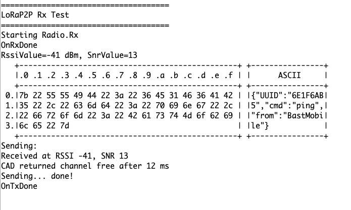

# RAK11200_LoRa_RX_TX

A simple LoRa RX/TX example for the [RAK11200 ESP32 Core](https://store.rakwireless.com/products/wiscore-esp32-module-rak11200) with a [RAK13300 LoRa SX1262 IO module](https://store.rakwireless.com/products/rak13300-wisblock-lpwan).

